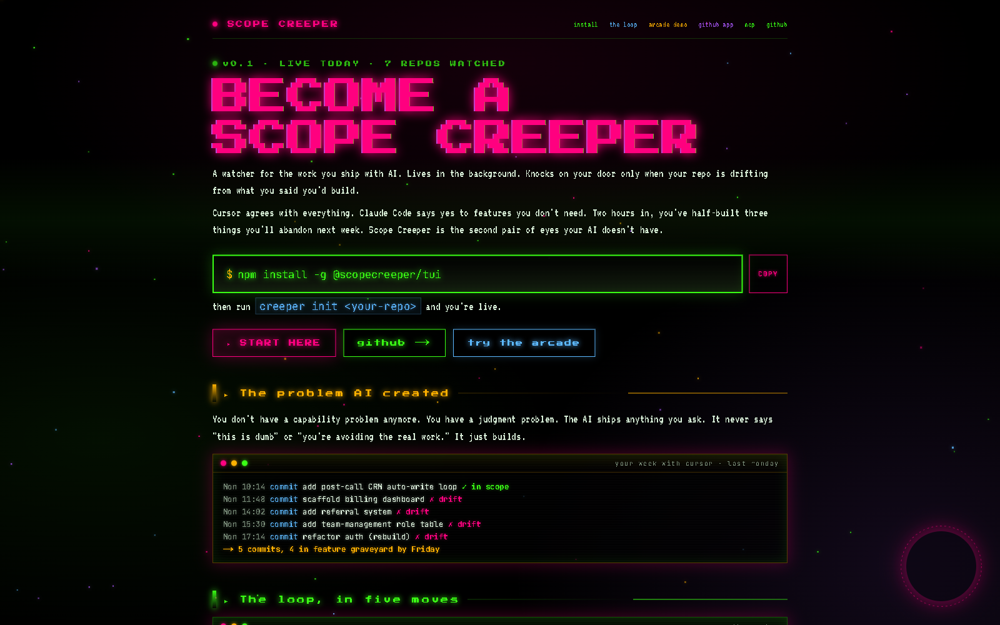

# Scope Creeper

[](https://github.com/SipMyBeers/scopecreeper/stargazers)
[](https://www.npmjs.com/package/@scopecreeper/mcp)
[](LICENSE)
[](https://scopecreeper.ai)

A watcher for the work you ship with AI. Background daemon scores every commit against your declared scope, fires a desktop notification when you drift, and hands you a ranked picker of what to do next. The second pair of eyes your AI doesn't have.



---

## Why this exists

You don't have a capability problem anymore. You have a judgment problem. Cursor agrees with everything. Claude Code says yes to features you don't need. Two hours in, you've half-built three things you'll abandon next week.

Scope Creeper is a small native daemon (8.6 MB RAM, written in Rust) plus an Ink TUI that lives alongside your editor. Every commit is scored against a `.scopecreeper.md` you keep at the repo root. Drift triggers a notification; you pick one of four routes; the decision lands in a per-repo diary your AI reads on the next session.

## What ships in this repo

| Package | Purpose | Status |
| --- | --- | --- |
| `apps/tui` (`creeper`) | The Ink TUI + CLI subcommands (`init`, `install-hook`, `precommit`, `daemon`) | working |
| `apps/daemon-rs` (`creeperd`) | Native Rust background daemon, 1.7 MB binary, 8.6 MB RSS | working |
| `apps/mcp` (`@scopecreeper/mcp`) | MCP server exposing `scan` / `kill` / `shippable` tools to Claude Code | [published](https://www.npmjs.com/package/@scopecreeper/mcp) |
| `apps/web` | Marketing site + arcade demo at [scopecreeper.ai](https://scopecreeper.ai) | live |

## Quick start (3 minutes)

The daemon and the TUI are one binary. Here's the full loop:

```bash
# 1. Clone and build
git clone https://github.com/SipMyBeers/scopecreeper.git
cd scopecreeper
pnpm install
pnpm --filter @scopecreeper/tui build
pnpm --filter @scopecreeper/tui exec npm link

# 2. Build the native daemon (recommended, optional — TUI falls back to Node if not present)
cd apps/daemon-rs
cargo build --release
cp target/release/creeperd /opt/homebrew/bin/    # or anywhere on PATH
cd ../..

# 3. Initialize a scope doc in any repo you want watched
creeper init ~/path/to/your-repo

# 4. Open the generated .scopecreeper.md and fill in the
#    "What this project is NOT" and "Explicitly deferred" sections.
#    Auto-generated bullets are based on README + last 30 commits.
$EDITOR ~/path/to/your-repo/.scopecreeper.md

# 5. Install the pre-commit drift check on that repo
creeper install-hook ~/path/to/your-repo

# 6. Start the background watcher (8.6 MB RSS, fires macOS notifications on drift)
creeper daemon
```

That's the whole install. Make a drifty commit in the watched repo and you'll get a desktop notification within a few seconds.

## Run as a launchd service (macOS)

Want the daemon to start at login and survive reboots? A ready-made launch agent is in the repo:

```bash
mkdir -p ~/Library/LaunchAgents ~/.config/scopecreeper
cp apps/tui/launchd/ai.scopecreeper.daemon.plist ~/Library/LaunchAgents/
launchctl load ~/Library/LaunchAgents/ai.scopecreeper.daemon.plist
```

Logs land in `~/.config/scopecreeper/daemon.log`. The plist sets a 4 AM daily restart to defeat any slow leak.

## The loop, in five moves

```
1. daemon          rust binary, 8.6 MB ram, watches every repo
2. every commit    scored against your .scopecreeper.md
3. drift detected  fires a macOS notification
4. action picker   you pick a route, each ranked by creep score
5. diary           per-repo .scopecreeper-diary.md, claude reads it
```

Press `?` in the TUI when you want to engage with pending drifts. You'll see an action picker with four routes, each scored:

```
DRIFT pick a route                            dittomethis #a3f7c2

adds apps/web/billing/page.tsx
73/100  ABYSS  ·  SCOPE EXPANDS UNCONTROLLABLY

REDIRECT   |#         |  15/100   recommended
    copy a "stop drifting" prompt to clipboard, paste into Claude
EXPAND     |#########|  88/100
    add this feature to .scopecreeper.md (legitimize)
KILL       |          |   0/100
    generate the autopsy artifact for the drifty branch
ACCEPT     |#######   |  73/100
    keep it, log a justification, scope unchanged
```

Whatever you pick writes an append-only entry to `<repo>/.scopecreeper-diary.md`. That file is the source of truth Claude reads on subsequent sessions, so it stops re-suggesting things you already rejected.

## Claude Code integration

The MCP server is published on npm so any MCP-aware client can install it directly:

```bash
claude mcp add scope-creeper -- npx -y @scopecreeper/mcp
```

This gives Claude three tools it can call mid-session: `scope_creeper_scan`, `scope_creeper_kill`, and `scope_creeper_shippable`. Sycophantic AI plus adversarial scope check produces better plans than either alone.

## Configuration

| Variable | Effect | Default |
| --- | --- | --- |
| `SC_API_URL` | Override the API endpoint | `https://scopecreeper.ai` |
| `SC_API_KEY` | Optional Pro key for higher rate limits | unset |
| `SC_NOTIFY_THRESHOLD` | Score threshold above which the daemon notifies | `60` |
| `SC_DRIFT_THRESHOLD` | Score above which a commit is logged as drift | `50` |
| `SC_BLOCKING=1` | Opt into a blocking "Why?" prompt at commit time | off |
| `SC_DISABLE=1` | Skip a single commit's pre-commit check | off |

## Architecture

```
scopecreeper/
  apps/
    daemon-rs/    Rust daemon (notify-rs + reqwest + osascript)
    tui/          Node CLI + Ink TUI (init, install-hook, precommit, daemon dispatcher)
    mcp/          Published MCP server: @scopecreeper/mcp
    web/          Next.js on Cloudflare Pages — landing + arcade demo at scopecreeper.ai
  packages/
    core/         Shared scoring, prompt, and type definitions
```

Memory profile of the daemon watching seven repos: **8.6 MB RSS**, 1.7 MB binary on disk. Each additional repo adds an OS-native FSEvent watcher costing a few hundred bytes — scales to dozens of repos before you notice it in Activity Monitor.

## Tech stack

- **Daemon:** Rust, tokio, notify-rs, reqwest (rustls), serde
- **CLI / TUI:** TypeScript, Ink, chokidar, MCP SDK
- **Web:** Next.js 16, Cloudflare Pages, Workers AI (Llama 3.3 70B)
- **Monorepo:** pnpm workspaces, Cargo

## Contributing

Issues and pull requests welcome. The repo follows the same scope discipline the tool enforces: every change needs to fit the `.scopecreeper.md` at the root. If your idea expands scope, open an issue first and let's discuss adding it to the in-flight section.

```bash
pnpm install
pnpm --filter @scopecreeper/tui build
pnpm --filter @scopecreeper/web dev
```

## License

MIT. See [LICENSE](LICENSE).

---

Site: [scopecreeper.ai](https://scopecreeper.ai) — Source: [github.com/SipMyBeers/scopecreeper](https://github.com/SipMyBeers/scopecreeper) — MCP: [npm/@scopecreeper/mcp](https://www.npmjs.com/package/@scopecreeper/mcp)
